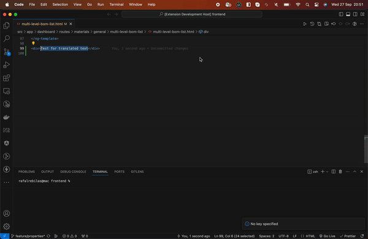

# auto-translate README

This is the README for auto-translate translations. It is used for simplification of translating plain texts for many languages concurrently.

## Features

#### Translate selected text in two easy steps!

1. Select the text, that you want to translate.
1. Open command pallete (ctrl + shift + p | cmd + shift + p)
1. Type in "AutoTranslate: Extract key and translate"
1. Type in key for selected text, that would appear in json file (supported nested objects with dot notation).
1. Shortly after, translated text would appear in every language file!

## Requirements

This extenstion assumes, that you are developing in **Angular**, with use of **ngx-translate** library for translations. For now it uses **DeepL** API for translations and requires specifying your personal API key (free one) to make http requests.

## Extension Settings

This extension contributes the following settings:

- `autoTranslate.settings.pathToTranslationFiles`: Specify path for translation files. Default 'src/assets/i18n'.
- `autoTranslate.settings.pathToTranslationFiles.deepLApiKey`: Set to your api key, after creating account in deepL service.

## Release Notes

### 0.0.1

- Translate selected text and write translations into `json` files

**Enjoy!**

## Features to add

- Skipping translation of parameters.
- Wrapping with text interpolation and adding translate pipe in `.html` files.
- You tell me!
